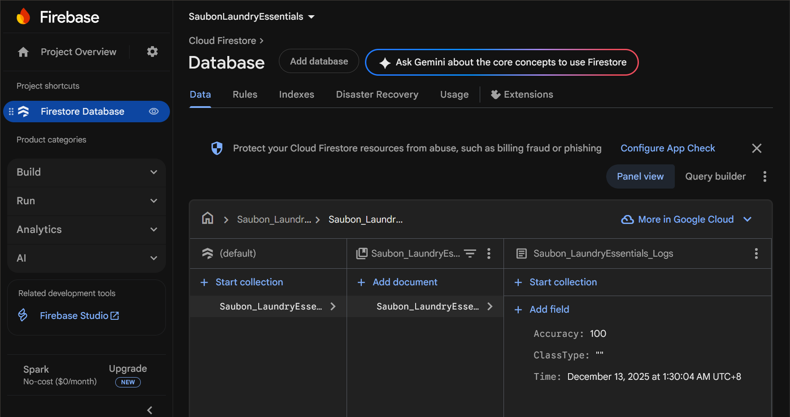
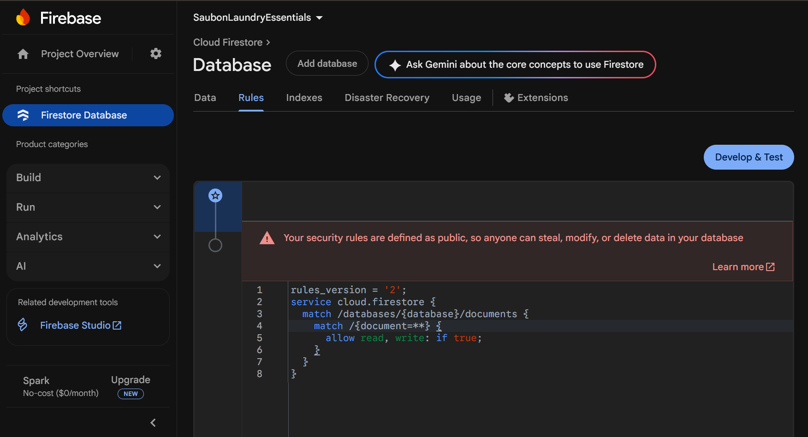
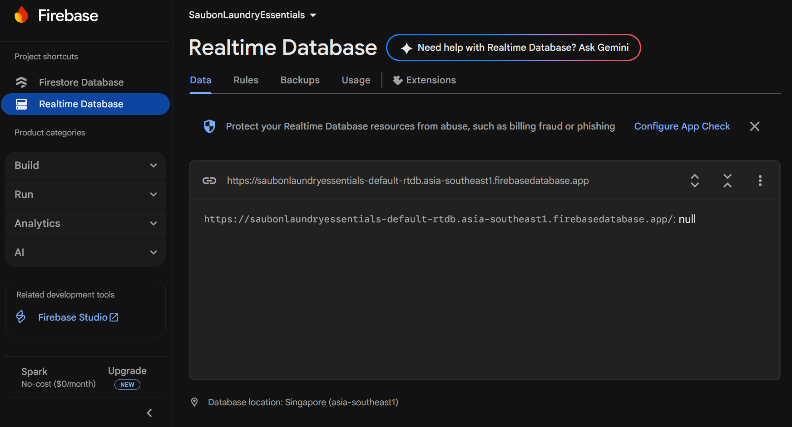
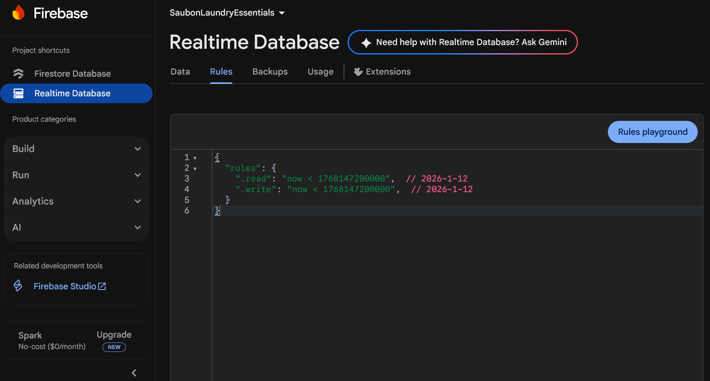

# SaubonLaundryEssentials: Firebase Backend Setup

## 📋 Project Overview
This repository documents the complete Firebase backend configuration for the **SaubonLaundryEssentials** project. It showcases the setup of essential cloud services including Cloud Firestore and Realtime Database, following the project specifications for logging and data management as per the Week 10-17 module on Backend Services and APIs.

## 🛠️ Implementation Details
Successfully implemented the required backend infrastructure:
*   **Cloud Firestore Database:** Configured with the dedicated collection `SaubonLaundryEssentials` containing the `SaubonLaundryEssentials_Logs` document.
*   **Data Model:** Created document with fields for `Accuracy` (Number: 100), `ClassType` (String: "row class"), `Time` (String: "1:20 PM"), and `Date` (String: "Enero 17, 2025").
*   **Realtime Database:** Established a separate Realtime Database instance in the Singapore (asia-southeast1) region.
*   **Security Rules:** Configured appropriate security rules for both databases in test mode for development.

## 📸 Setup Documentation

### 1. Cloud Firestore Database
This screenshot shows the created `SaubonLaundryEssentials` collection with the `SaubonLaundryEssentials_Logs` document containing the required fields.

### 2. Cloud Firestore Security Rules
Security rules configured in test mode (`allow read, write: if true;`) for the development phase.

### 3. Realtime Database
The Realtime Database console showing the initialized database structure with Singapore location.

### 4. Realtime Database Security Rules
Security rules for the Realtime Database, set with an expiration date (January 12, 2026) for development access.

## 🚀 Next Steps
This setup provides a solid foundation. The next phase can involve:
*   Integrating this backend with a frontend application.
*   Implementing proper authentication-based security rules for production.
*   Expanding the data structure to manage laundry essentials inventory, orders, or customer data.
*   Configuring Firebase Storage for product images.

---

*This setup was completed as part of the Week 10-17 module: **Backend Services and APIs**.*
